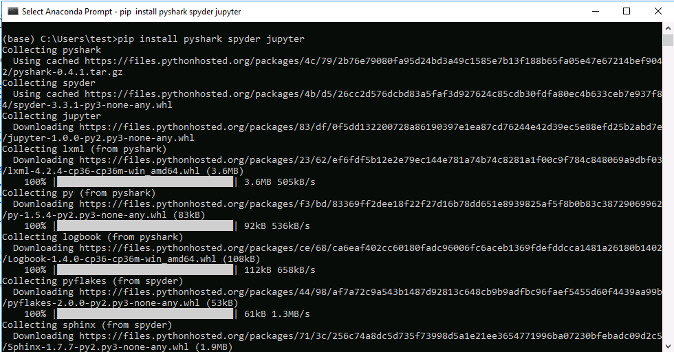

Anaconda本身分为 Anaconda 2和Anaconda 3 系列，分别提供对 python 2.x 语
言 和 python 3.x语言的支持。本门课使用 Anaconda 3（Miniconda 3）以及相
关的工具库进行网络数据包分析工具。另外，Miniconda 是 Anaconda 的精简发
行版。

## 下载 Anaconda3

从 <https://mirrors.tuna.tsinghua.edu.cn/anaconda/archive/>下载
Anaconda 3。依据你的操作系统是64位还是32位的Windows，下载对应的版本。
如果操作系统是64位的Windows，下载
<https://mirrors.tuna.tsinghua.edu.cn/anaconda/archive/Anaconda3-5.2.0-Windows-x86.exe>
；如果操作系统是32位的Windows，下载
<https://mirrors.tuna.tsinghua.edu.cn/anaconda/archive/Anaconda3-5.2.0-Windows-x86_64.exe>
。

下面的命令会以在64位Windows上安装
`Anaconda3-5.2.0-Windows-x86_64.exe.`为例。在32位的情况下，请对命令里
的参数作相应替换。

当然，如果网络实在太糟糕，那么可以选择安装精简版的Miniconda 3。精简版
的Miniconda 3从
<https://mirrors.tuna.tsinghua.edu.cn/anaconda/miniconda/>下载。相应地，
需要替换后续命令里的部分参数或者额外做一些安装软件包的工作。

## 安装 Anaconda 3

双击 `Anaconda3-5.2.0-Windows-x86_64.exe`直接安装，所有配置
选项采用默认设置。

## 设置python软件包更新源的镜像

这一步为选做。

用文本编辑器（比如notepad）编辑 `%APPDATA%\pip\pip.ini` 文件，在里面
顶格输入下面三行配置并保存（请务必注意配置文件的后缀名，必须是.ini，不
能是.ini.txt或者.txt）：

``` shell
[global]
trusted-host=pypi.tuna.tsinghua.edu.cn
index-url=https://pypi.tuna.tsinghua.edu.cn/simple
```

采用国内的python软件包更新源镜像，通常会提升软件包的下载速率。

## 设置Anaconda的源

同样地，也是为了后续使用conda命令时能够比较快地下载软件包，在开始菜单
里找到`Anaconda3` ，点击 `Anaconda Prompt`，然后在出来的cmd命令行窗口
里输入下列命令并回车：

``` python
conda config --add channels 'https://mirrors.tuna.tsinghua.edu.cn/anaconda/pkgs/free/'
conda config --set show_channel_urls yes
conda config --show # 看看当前的 config 是什么样的
```

好了，这样可以开心的下载东西了。

### 如何删除添加的源呢？

这一步Just for your information，目前没有必要执行。

``` python
conda config --remove channels 'https://mirrors.tuna.tsinghua.edu.cn/anaconda/pkgs/free/' 
```

## 更新pip


在开始菜单里找到 `Anaconda3` ，点击 `Anaconda Prompt`，然后在出来的cmd
命令行窗口里输入下列命令并回车：

``` python
python -m pip install -U pip
```


[图1] 更新pip

注意看cmd命令行窗口是否输出了红色和黄色的错误和警告信息。如果有，则表明用pip安装/更新软件包出错（下同）。

## 安装分析wireshark数据包文件所需的工具库

### 安装jupyter

如果安装的是Miniconda 3，这一步需要做；如果安装的是Anaconda 3，这一步跳过。

在开始菜单里找到 `Anaconda3` ，点击 `Anaconda Prompt`，然后在出来的cmd
命令行窗口里输入下列命令并回车：

``` shell
pip install jupyter
```

不出意外的话会看到：



[图2] 安装分析wireshark数据包文件所需工具库

### 安装pyshark

请看[下一篇教程](install_pyshark_from_github.md)。

**版权所有 (c) 2018 (贵州理工学院 大数据学院 张森)**

**电子邮件: 20120061 \# git dot edu dot cn**

**更新时间: 2018-08-30**

