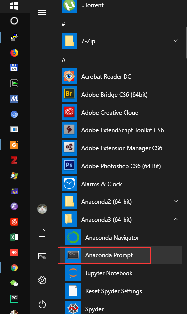
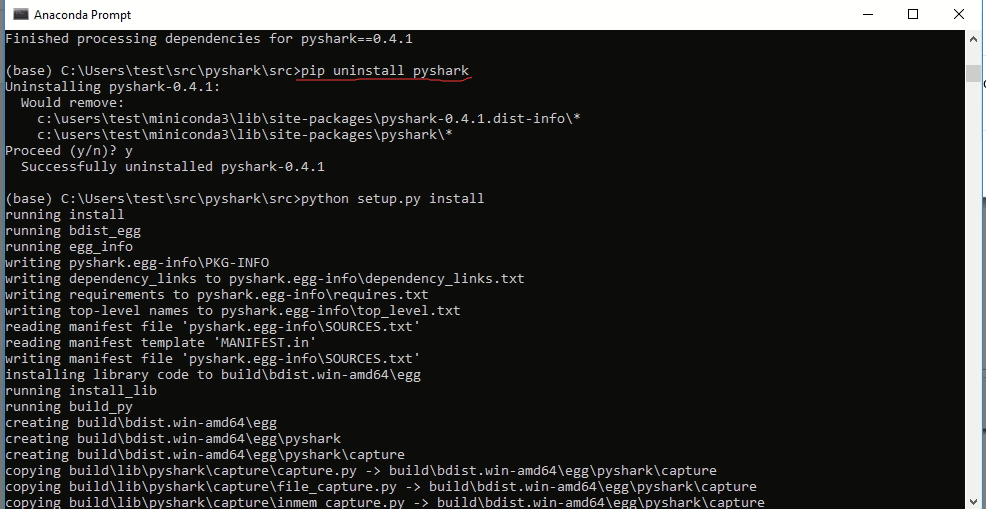
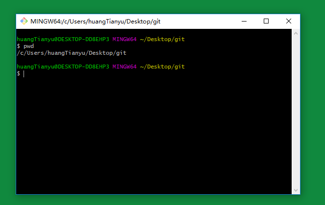
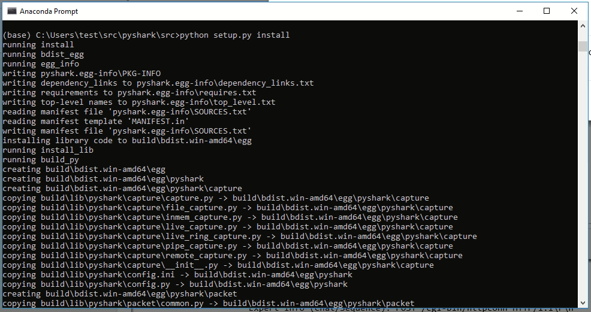

在windows上从github检出python 模块pyshark的代码并安装

0、卸载已有的pyshark

如果原本安装过pyshark，先卸载它。否则跳过。

1.  运行anaconda prompt



2.  先卸载以后pyshark

``` shell
pip uninstall pyshark
```



1、在windows上安装命令行工具

根据https://www.jianshu.com/p/122f5bf8749e
的方法，照着做完，看到类似如下的界面：



2、检出代码

a\. 假设要把代码放到 d:\\src 下，那么要建立 d:\\src 这个目录。

b\. 运行git bash，用cd命令切换到想用来放源代码的目录 /d/src 里：

``` shell
cd /d/src
```

c\. 从github.com克隆（检出）代码

``` shell
git clone <https://github.com/md11235/pyshark.git>
```

3、安装从github拿到的代码

1.  运行anaconda prompt


2.  从检出的源代码安装pyshark

用如下命令切换到d:\\src ：

``` shell
d:
cd d:\\src
```

然后运行

``` python
python setup.py install
```


